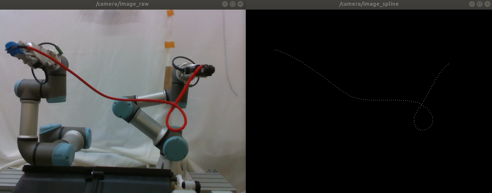

# DLO Tracking
## Description
This repository is an implementation of the DLO tracking algorithm, which given a mask of the DLO,
returns the B-spline which approximates the shape of the mask.
Presented method is able to run in real-time.

## Usage
### Option 1: Using python3 
* Clone repository
  ```
  git clone https://github.com/pkicki/cable_observer
  ```
* Download videos from [here](https://drive.google.com/drive/folders/1taSxE8XdUbhhhGJnhtnSJg1tgyOTRgRI?usp=sharing) and put them into `cable_observer/videos/` directory
* Install necessary dependencies
  ```
  pip3 install -r requirements.txt
  ```
* Make sure the file `cable_observer.py` is executable
  ```
  chmod +x cable_observer.py
  ```
* Run `cable_observer.py` for tracking on videos
  ```
  ./cable_observer.py --video /path/to/video_file --debug
  ```

### Option 2: Using ROS
* Clone repository into src directory in the ROS workspace
  ```
  git clone https://github.com/pkicki/cable_observer
  ```
* Download videos from [here](https://drive.google.com/drive/folders/1taSxE8XdUbhhhGJnhtnSJg1tgyOTRgRI?usp=sharing) and put them into `cable_observer/videos/` directory
* Install necessary dependencies
  ```
  rosdep install --from-path src/cable_observer
  ```
* Make sure the file `scripts/cable_observer_node.py` is executable
  ```
  chmod +x scripts/cable_observer_node.py
  ```
* Run `cable_observer.launch` for tracking on videos
  ```
  roslaunch cable_observer cable_observer.launch video:=/path/to/video_file debug:=true
  ```
* You may check provided topics `/spline/coeffs` and `/spline/coords` using `rostopic echo /topic/path`

### Available arguments:
  * `camera` - camera mode (default), you may specify camera ID (corresponding to /dev/videoX)
  * `video` - video mode, you may specify path to video vile
  * `images` - images mode, you may specify path to directory
  * `debug` - run debug mode, default false
  * `save_dataframe` - save splines metadata, default false
  * `save_output` - save splines images, default false

### Configuration file
Check the configuration file `config/params.yaml` to tune the parameters.




### Citing DLOFTBs
If you find this codebase useful in your research, please consider citing:
```
@inproceedings{kicki2023dloftbs,
    Title={DLOFTBs -- Fast Tracking of Deformable Linear Objects with B-splines},
    Author={Kicki, Piotr and Szymko, Amadeusz and Walas, Krzysztof},
    Booktitle = {International Conference on Robotics and Automation (ICRA)},
    Year = {2023}
}
```
